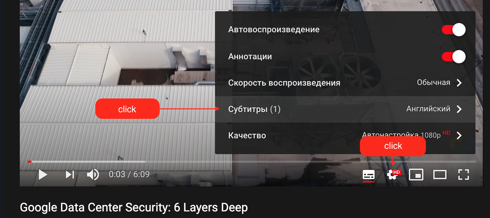

# Домашнее задание к занятию «2.4. Моделирование угроз»

В качестве результата пришлите ответы на вопросы в личном кабинете студента на сайте [netology.ru](https://netology.ru).

В каждом задании сформулирован один (или несколько вопросов), и вам нужно найти ответы в соответствующем нормативно-правовом акте (далее – НПА).

Обратите внимание:
* там, где требуется указать понятие, необходимо привести это понятие целиком 
* там, где необходимо описать иное (например, ответить на вопрос "в течение какого времени", "какая ответственность" и т.д.) достаточно ответа собственными словами (как вы поняли) и указания номера статьи и пункта.

Обратите внимание, что справочная система КонсультантПлюс в бесплатной редакции не даёт копировать текст документа.

Важно: правовые системы предлагают платную подписку на комментарии, аналитические материалы и подборки ссылок. В рамках нашего курса платная подписка не требуется. Все ДЗ рассчитаны на работу исключительно с бесплатной версией. Поэтому, пожалуйста, нигде не вводите данные своих карт и т.д.

## Задача Меры безопасности

Как мы уже говорили, разработка модели угроз - не та задача, которую можно выполнить за пару часов. Это первое. Второе - чтобы уметь грамотно её разрабатывать, нужно иметь достаточно хороший опыт и кругозор.

А опыт и кругозор появляются либо за счёт личного участия в проектах (и набивания своих "шишек"), либо ознакомления с тем, "как делают другие".

Соответственно, этим (ознакомления с тем, "как делают другие") мы сейчас и займёмся.

Мы предлагаем вам для разбора два видео, о том, как устроена система безопасности в дата-центрах Google (смотрите их именно в этом порядке):
1. 18.06.2020 - https://www.youtube.com/watch?v=kd33UVZhnAA (длительность - 06:09)
1. 18.09.2013 - https://www.youtube.com/watch?v=cLory3qLoY8 (длительность - 07:00)

Нам нужны ответы от вас на следующие вопросы:
1. Сколько уровней безопасности предусмотрено?
1. Как вы думаете, зачем и исходя из чего выполнено разбиение на эти уровни?
1. Опишите, какие меры безопасности предпринимаются и предположите для каких сценариев (это должно быть явно видно из принимаемых мер)

Обратите внимание, если у вас недостаточно хороший уровень английского языка, вы можете включить авто-перевод субтитров.

Для этого нужно нажать на кнопку включения субтитров:

После чего перейти в меню настройки и снова выбрать субтитры:

Выбрать перевести:

Выбрать русский язык:

Обратите внимание, что перевод не всегда корректный, но большая часть должна быть понятна из контекста.

