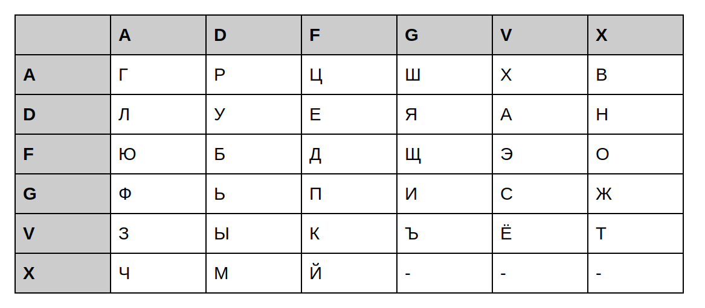
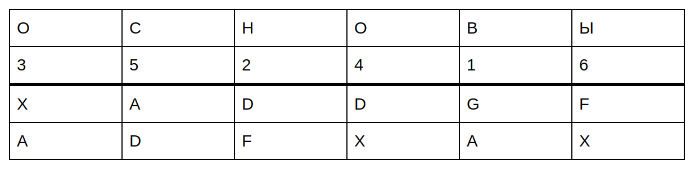
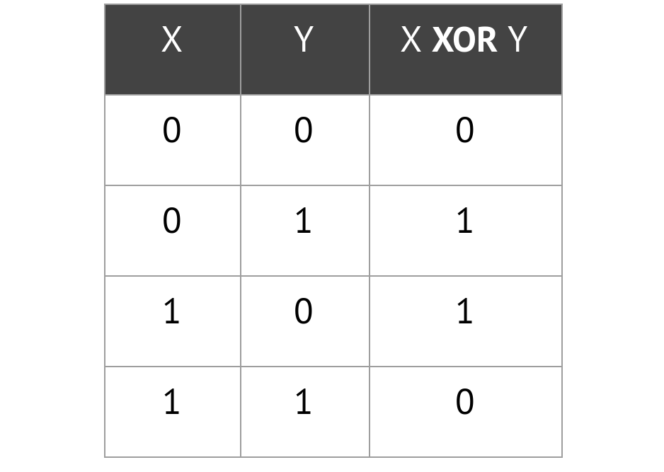
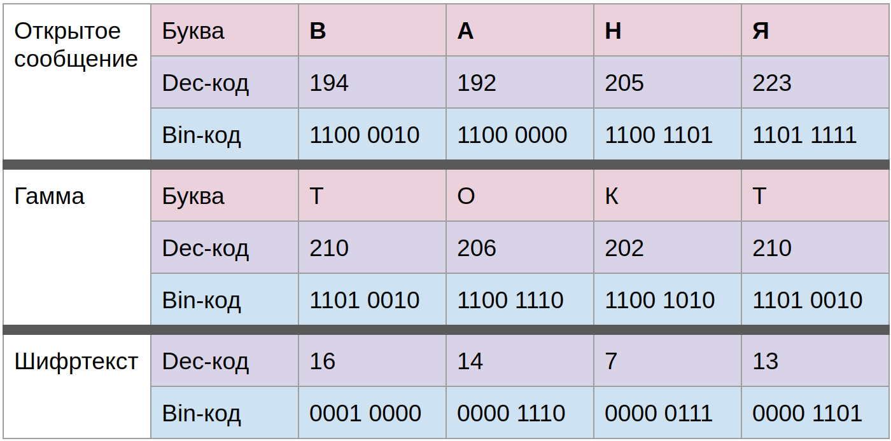
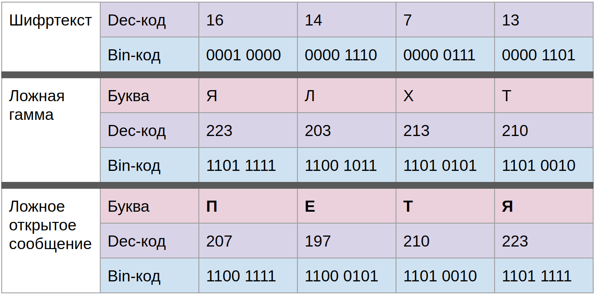

# Домашнее задание к занятию «Теоретические основы криптографии»

В качестве результата пришлите ответы на вопросы в личном кабинете студента на сайте [netology.ru](https://netology.ru).

## Задача №1 Шифр ADFGVX

### Справка 
Данный шифр является продолжением (расширением) шифра ADFGX с похожим способом применения. Активно использовался во время Первой мировой войны.

### Инструкция 

Шифр предполагает 2 этапа: сначала замена, затем перестановка.

#### 1 Этап. Замена: 

Создается таблица шифрозамен в духе Полибианского квадрата, но не в алфавитном порядке, например:

Сообщение «ЧУПРОВ» записывается набором шифрозамен по координатам таблицы: «XA DD GF AD FX AX».

#### 2 Этап. Перестановка:

Полученный набор шифрозамен записывается построчно сверху-вниз в таблицу, количество столбцов которой определяется по ключевому слову. Нумерация столбцов соответстветствует положению букв ключевого слова в алфавите. Например, для ключевого слова  «ОСНОВЫ» таблица будет выглядеть следующим образом:

Выписывание шифра происходит по столбцам в соответствии с их нумерацией, а буквы объединяются в пятибуквенные блоки. Для нашего примера итоговый шифр: GADFX ADXAD FX.

### Задача 

Зашифруйте свою фамилию, используя оригинальные (выдумайте сами) ключи и таблицы замены и перестановки.

При оформлении ответа приведите:
1. Исходное сообщение (фамилию)
1. Таблицы замены и перестановки
1. Ключ
1. Зашифрованное сообщение

## Задача №2 Шифр Вернама (сложение по модулю 2)
             
### Справка 
 
Шифр Вернама был создан в 1917 году для шифрования телеграфных сообщений. Использовался после Первой мировой войны, во время Второй мировой войны, а также после войны - для секретного общения между правительствами США и России. В основе шифра Вернама лежит операция “сложение по модулю 2” (XOR, логическое ИЛИ) над 0 и 1.
 
### Инструкция 
 
Таблица истинности для XOR приведена в таблице 1
 
Таблица 1. Таблица истинности для XOR

Для шифрования необходимо использовать двоичную систему. Таблица соответствия символов (букв алфавита) и двочиных кодов приведена [по ссылке](https://tehtab.ru/Guide/GuideMathematics/GuideMathematicsNumericalSystems/TableCodeEquivalent/)

Примечание: Когда ключ равен длине сообщения, он называется гамма.

### Пример

Пример шифрования сообщения “ВАНЯ” с помощью ключа “ТОК” показан в таблице 2. Так как ключ “ТОК” меньше длины сообщения, для формирования гаммы он циклически повторяется.

Таблица 2. Шифрование по модулю 2

Данное шифрование обладает отличным свойством - можно направить злоумышленника по ошибочному следу, сообщив ему ложную гамму, которая даст смысловое сообщение при попытке расшифровки.

### Задача 

Зашифруйте свою фамилию, а также создайте смысловое ложное сообщение, используя оригинальные (выдумайте сами) гамму и ложную гамму.

При оформлении ответа приведите:
1. Исходное сообщение (фамилию)
2. Гамму
3. Таблицу шифрования
4. Ложную гамму
5. Таблицу ложной расшифровки
