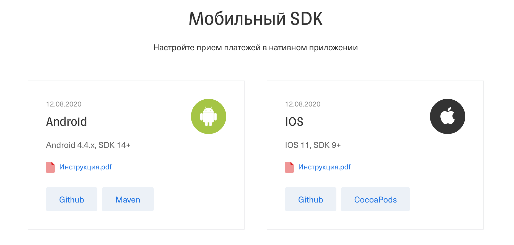

# Домашнее задание к занятию «4.1. Финансовые системы»

В качестве результата пришлите ответы на вопросы в личном кабинете студента на сайте [netology.ru](https://netology.ru).

В каждом задании сформулирован один (или несколько вопросов), и вам нужно найти ответы в соответствующем нормативно-правовом акте (далее – НПА).

Обратите внимание:
* там, где требуется указать понятие, необходимо привести это понятие целиком 
* там, где необходимо описать иное (например, ответить на вопрос "в течение какого времени", "какая ответственность" и т.д.) достаточно ответа собственными словами (как вы поняли) и указания номера статьи и пункта.

Обратите внимание, что справочная система КонсультантПлюс в бесплатной редакции не даёт копировать текст документа.

Важно: правовые системы предлагают платную подписку на комментарии, аналитические материалы и подборки ссылок. В рамках нашего курса платная подписка не требуется. Все ДЗ рассчитаны на работу исключительно с бесплатной версией. Поэтому, пожалуйста, нигде не вводите данные своих карт и т.д.

## Задача №1 - ГОСТ Р 57580

Вам необходимо изучить ГОСТ Р 57580. Документ состоит из двух частей:
1. ГОСТ Р 57580.1-2017
1. ГОСТ Р 57580.2-2018

Ответьте на следующие вопросы:
1. Что такое контур безопасности?
1. Что/кто является субъектом доступа (в рамках данного стандарта)? Какие основные типы их рассматриваются?
1. Что такое компрометация аутентификационных данных?
1. Что такое фактор аутентификации? На какие категории подразделяются факторы? 
1. Что такое однофакторная и многофакторная аутентификация?
1. Чем событие ЗИ отличается от инцидента ЗИ?
1. Что такое компенсирующие меры? В каких случаях они применяются?
1. Сколько уровней ЗИ определяет стандарт? Перечислите их.
1. Какой из всех возможных объектов атак нарушитель выберет с наибольшей вероятностью (с точки зрения авторов стандарта)?
1. Для оценки полноты реализации процессов системы ЗИ используют качественную модель оценивания. Приведите уровни соответствия с их описанием, указанные в данной модели?
1. Что рекомендуется использовать в качестве основных источников свидетельств для оценки соответствия ЗИ?

## Задача №2 - Тинькофф Мобильный SDK

Банк Тинькофф предлагает [Мобильный SDK](https://oplata.tinkoff.ru/develop/sdk/) для встраивания в мобильные приложения возможностей оплаты с карт.



SDK (Software Development Kit) - набор инструментов для упрощения разработки. В частности, в случае Tinkoff - это набор уже реализованных программных блоков, которые программисты могут использовать для ускорения процесса интеграции платежей в собственное мобильное приложение.

По традиции, мы на всякий случай локально сохранили копии документов для [Android](assets/android.pdf) и [iOS](assets/ios.pdf).

### Справка

OpenSSL позволяет [вычислять хэши по разным алгоритмам](https://www.openssl.org/docs/manmaster/man1/dgst.html), например, для md5:

```shell script
openssl dgst -md5 file.txt
```

Где `file.txt` - это файл, внутри которого хранятся данные, для которых нужно рассчитать хэш.

Конечно же, это не всегда удобно (плюс некоторые редакторы добавляют в файл перенос строки и у вас получается неверный хеш).

Современные командные оболочки предлагают нам синтаксис, позволяющий направить на вход одному приложению (аналог ввода "руками") данные из вывода другого приложения. Это так называемый pipe (труба).

Выглядит это следующим образом:

```shell script
echo -n 'Netology' | openssl dgst -md5
(stdin)= f9b9c75ad5aa4b6acd7cf3d1a282d5b1
```

Где команда `echo` выводит строку `Netology`, опция `-n` не добавляет перенос строки, а символ `|` "перенаправляет" этот вывод на вход команды `openssl`. Таким образом, нам не обязательно вводить хэш руками или сохранять в файл.

Кроме того, в рамках решения задачи вам понадобится использовать [кодировку base64](https://tools.ietf.org/html/rfc4648).

Base64 - это кодировка, используемая для кодирования данных при передаче в ситуациях, когда окружение допускает только передачу в виде символов, соответствующих [ASCII](https://tools.ietf.org/html/rfc20).

Для этого есть соответствующие флаги [в команде enc](https://www.openssl.org/docs/manmaster/man1/openssl-enc.html):
* закодировать файл в base64: `openssl enc -base64 -in msg.txt -out msg.base64`
* декодировать из base64: `openssl enc -d -base64 -in msg.base64 -out msg.txt`

### Задача

#### Токен сообщения

В рамках документации описано формирование подписи сообщения (в терминологии документа - `Token`), которая позволяет верифицировать, что сообщение действительно от вас. Вам нужно найти описание этого алгоритма и подписать следующий документ:

```json
{
  "TerminalKey": "TerminalKey",
  "Amount": "100000",
  "OrderId": "10001",
  "Description": "Подарочная карта на 1000 рублей"
}
```

В качестве пароля (password) используйте строку `TopSecret`. 

<details>
<summary>Подсказка</summary>

Нехорошо смотреть подсказки 😈!

Но, если не нашли, то в [Android](assets/android.pdf) на 36-ой странице, в [iOS](assets/ios.pdf) на 61.

Отдельно есть [пошаговая инструкция](https://oplata.tinkoff.ru/develop/api/request-sign/).
</details>

В качестве результата пришлите Token для указанного документа.

#### Шифрование карточных данных

**Важно**: это подзадание не обязательно, его выполнение не влияет на получение зачёта.

В рамках документации описывается механизм передачи карточных данных с мобильного устройства на сервер (они не передаются в открытом виде). Вам нужно найти описание этого алгоритма и зашифровать следующие карточные данные:
* PAN=4300000000000777
* ExpDate=0823
* CardHolder=COURSAR
* CVV=999

<details>
<summary>Подсказка</summary>

Нехорошо смотреть подсказки 😈!

Но, если не нашли, то в [Android](assets/android.pdf) на 36-ой странице, в [iOS](assets/ios.pdf) на 62-ой.

Отдельной пошаговой инструкции нет.
</details>

Мы, по традиции, предоставляем вам [публичный](assets/public.key) и [приватный](assets/private.key) ключи (вы сами должны разобраться, что и когда используется).

Что нужно:
1\. Зашифровать указанные данные в соответствии с алгоритмом, указанным в документации (не забудьте проверить, что они нормально расшифровываются после вашего шифрования)

<details>
<summary>Подсказка</summary>

Используйте команды `openssl` из ДЗ по ассиметричным криптосистемам.

Обратите внимание, что шифротекст в нашем случае каждый раз будет разным (если вдруг вы решите посчитать контрольную сумму от зашифрованного файла).
</details>

2\. Прислать перечень команд, использованных вами для шифрования и расширования

## Дополнительное чтение про утечку приватных ключей

<details>
<summary>Читать</summary>

Ещё раз возвращаясь к теме утечки приватных ключей: есть специальный веб-сервис [GitGuardian](https://www.gitguardian.com), который как раз анализирует репозитории с кодом на наличие публикации ключей и присылает владельцам репозиториев Alert'ы:


Рекомендуем вам ознакомиться [со статьёй в их блоге](https://blog.gitguardian.com/leaking-secrets-on-github-what-to-do/), которая описывает уже меры реагирования на подобные инциденты и предлагает сервис, в реальном времени анализирующий каждый "коммит" (фиксацию изменений в коде) на наличие "секретов".

Это достаточно важная тема (мы, конечно, забегаем немного вперёд - детально это будет обсуждаться в блоке по разработке), особенно если вы будете работать в компаниях, в которых разрабатывается ПО (а сейчас практически любая компания от магазина до банка занимается разработкой/доработкой ПО для себя).   
</details>
