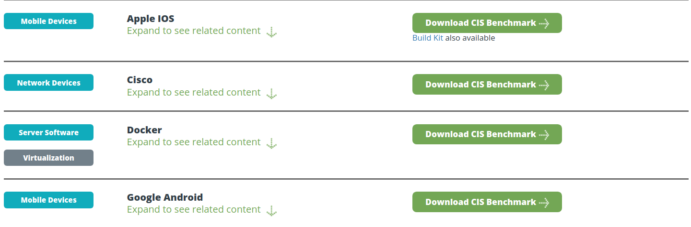

# Домашнее задание к занятию «4.2. Международные и отраслевые стандарты»

В качестве результата пришлите ответы на вопросы в личном кабинете студента на сайте [netology.ru](https://netology.ru).

В каждом задании сформулирован один (или несколько вопросов), и вам нужно найти ответы в соответствующем нормативно-правовом акте (далее – НПА).

Обратите внимание:
* там, где требуется указать понятие, необходимо привести это понятие целиком 
* там, где необходимо описать иное (например, ответить на вопрос "в течение какого времени", "какая ответственность" и т.д.) достаточно ответа собственными словами (как вы поняли) и указания номера статьи и пункта.

Обратите внимание, что справочная система КонсультантПлюс в бесплатной редакции не даёт копировать текст документа.

Важно: правовые системы предлагают платную подписку на комментарии, аналитические материалы и подборки ссылок. В рамках нашего курса платная подписка не требуется. Все ДЗ рассчитаны на работу исключительно с бесплатной версией. Поэтому, пожалуйста, нигде не вводите данные своих карт и т.д.

## Задача №1 - ГОСТ Р ИСО/МЭК 27000-2021

Вам необходимо изучить ГОСТ Р ИСО/МЭК 27000-2021

Ответьте на следующие вопросы:
1. Что СМИБ?
1. Что такое актив? Какие виды активов бывают? Являются ли сотрудники активом?
1. Что такое атака?
1. Какие дополнительные свойства также могут быть включены в понятие информационная безопасность? Что они означают (дайте им определение)?
1. Что такое риск информационной безопасности?

## Задача №2 - CIS Benchmarks*

**Важно**: это необязательная задача, её (не)выполнение не влияет на получение зачёта по ДЗ.

Организация [CIS](https://www.cisecurity.org/) предоставляет возможность скачать и просмотреть [CIS Benchmarks](https://www.cisecurity.org/cis-benchmarks/) (если ссылки не открываются, вы можете файлы CIS Benchmarks посмотреть в личном кабинете, в задании это пункт 1):

Возможность эта предоставляется бесплатно, но необходимо будет заполнить ряд сведений о себе (персональных данных):

Вам необходимо ознакомиться с бенчмарками на:
* Apple iOS (iOS 13 v1.0.0)
* Google Android (v1.3.0)

И ответить на следующие вопросы:
1. Сколько `configuration profiles` определяется в каждом документе? Приведите краткую их характеристику (на что направлены, для чего предназначены)
1. iOS: из каких соображений рекомендуется отключить опцию `Allow Siri while device is locked`?
1. iOS: из каких соображений рекомендуется включить опцию `Force fraud warning`?
1. iOS: к каким последствиям приведёт включение опции `Maximum number of failed attempts`?
1. Android: из каких соображений рекомендуется включить опцию `Allow remote lock and erase`?
1. Android: из каких соображений рекомендуется отключить опцию `Make pattern visible`? Что из себя представляет `shoulder surfing attack`?
1. Android: из каких соображений рекомендуется обеспечить отсутствие `Guest profiles`?

